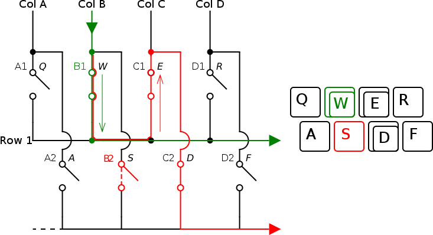
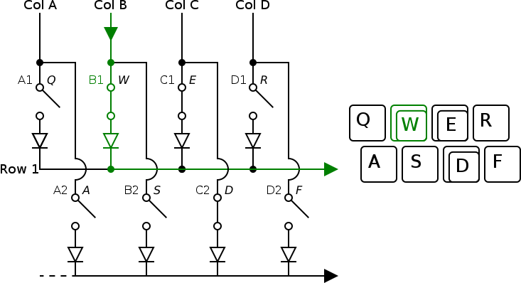

# Proyecto-Micro

## Puntos a tener en cuenta para el proyecto

- Cuando se presiona una tecla, el controlador la detecta y convierte en un código especifico. (buscar “scan code”).
- Se puede detectar la tecla por polling o interrupciones. Cuando se detecta una tecla presionada, el controlador registra la fila y columna afectada y convierte esta información en un código de scan. El código de scan es una representación numérica que identifica de manera única la pos. del teclado.
- USB usando perfil HID (Human Interface Device) donde se envían “reportes” de teclado que indican el estado (presionado o liberado) de cada tecla
- uso de diodos para evitar el ghosting

## Estructura de matriz con diodos (Anti-ghosting)

ciertas combinaciones de varias teclas presionadas puede crear rutas eléctricas involuntaria, que el controlador puede interpretar erróneamente como teclas adicionales (ghosting)

En este ejemplo están presionadas las teclas W, E y D simultáneamente pero el controlador detecta que la tecla S también está siendo presionada cuando en realidad no lo está.

para solucionar esto conectamos una serie de diodos entre el interruptor y la fila.A 

## Reporte de un teclado normal

**BYTE 1 -** Indica el estado de las teclas modificadoras (Shift, Ctrl, Alt, Fn)  donde cada bit representa una tecla modificadora

**BYTE2** - Reservado

**BYTE3-8**  - Contienen los códigos de escaneo de hasta 6 teclas simultáneamente presionadas. (un byte por tecla)

## Estructuras de Datos

**PERFIL -** 1Byte.

**REPORTE - 5**Bytes.
